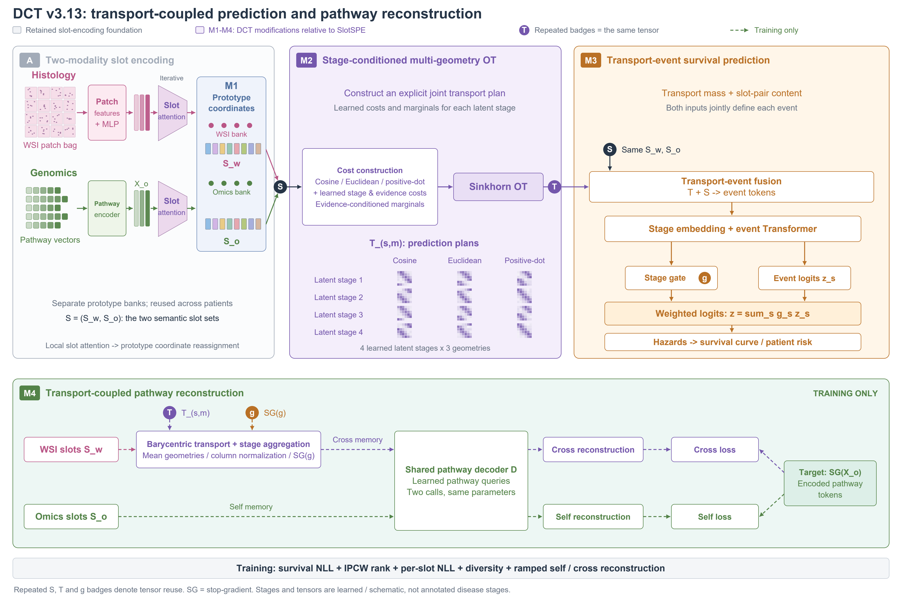
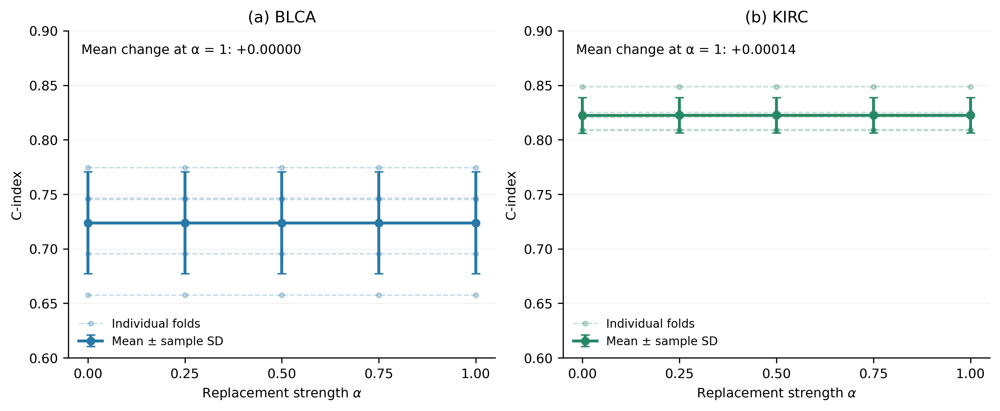

# DCT 面向多模态生存预测的阶段条件最优运输与运输感知通路重建

## 摘要

全切片病理图像与分子组学提供互补的癌症预后信息，但两种模态缺少细粒度配对标注，患者内学习得到的槽也不天然具有一致的跨患者索引。本文提出 DCT，以模态内共享原型组织槽表示，在紧凑槽空间中学习阶段条件多几何最优运输，并将同一运输计划同时用于生存风险读取与通路表征重建。模型首先将病理图像块和组学通路编码为少量槽，再通过阶段配对代价和证据边际求解运输计划。训练时，组学槽执行自重建，病理槽经事实运输聚合到组学侧后执行跨模态重建；两条支路共享通路查询解码器，从而为预测路径中的匹配结构提供辅助约束。

现有 UNI2-h 五折最佳验证记录覆盖十个 TCGA 癌症队列，完整模型的队列平均 C-index 为 0.7030。在 BLCA 和 KIRC 的同架构损失消融中，完整联合目标分别达到 0.7238 和 0.8224，相对仅患者级 NLL 提高 2.37 和 1.04 个 C-index 百分点。重跑并审计的机制对照显示，Full 相对 Direct 分别提高 2.09 和 1.94 个百分点，相对 Independent 分别提高 1.45 和 1.70 个百分点。这些结果支持当前完整训练配方与运输计算路径的任务价值。本文采用单随机种子、按验证集选择最佳 epoch 的评价口径；平均提升不表述为统计显著、独立测试泛化或生物学因果证据。

关键词：多模态生存预测；计算病理；槽表示；最优运输；通路重建

## 1 引言

癌症生存预测需要从患者的组织形态与分子状态中识别预后信息。全切片病理图像呈现组织结构、细胞形态和微环境，组学输入描述分子通路状态。两者在数量和表示尺度上差异明显：病理侧包含大量图像块，组学侧由若干通路向量组成。联合建模既需要压缩输入，也需要决定哪些跨模态信息应当联系，以及这些联系如何参与删失条件下的风险学习。

跨模态共同注意力能够建立病理实例与组学特征之间的交互，最优运输为软匹配提供边际质量约束 [1,2]。SlotSPE 进一步将多模态证据组织为患者特异的结构化预后槽，并使用重建学习保留输入信息 [3]。槽式表示减少了交互规模，但患者内的槽具有交换性；同一编号不自动对应同一组织或分子事件。与此同时，只由患者级预测目标监督的匹配，可能缺少对可恢复分子信息的直接约束。

本文研究的路径是先建立可复用的模态内原型坐标，再让跨模态运输共同承担预测与重建。DCT 使用分别学习、跨患者共享的两套模态内原型，将局部槽组织为固定索引的表示；随后在多个潜在阶段与几何分支中求解运输计划。运输质量和配对槽内容共同形成事件表示，用于离散时间生存预测。固定原型索引提供可复用的计算坐标，其生物学含义仍需注释与跨患者一致性分析确认。

DCT 的运输感知重建直接复用预测使用的事实计划。病理槽先通过该计划聚合到组学侧，再由可学习通路查询恢复编码后的通路 token；组学槽使用同一解码器执行自重建。目标 token 和阶段融合权重停止梯度，运输计划与槽内容保持可微，使辅助重建能够约束实际匹配路径。患者级 NLL、IPCW 排序、逐槽生存监督和多样性约束共同组成训练目标。

本文的主要工作包括：

1. 构建以模态内共享原型为坐标、以阶段条件多几何运输为交互、以运输事件为风险读取单元的多模态框架。
2. 将同一预测运输计划用于通路嵌入重建，使跨模态重建约束通过真实运输结构回传，而不是仅在未对齐的病理槽上解码。
3. 在十队列记录与 BLCA/KIRC 的损失、机制对照中分析平均性能，并明确区分联合训练收益、运输机制对照和描述性解释。

本文沿用槽注意力、最优运输、删失感知学习和重建任务的既有技术基础。贡献集中于这些组件之间的具体计算联系及相应实验，不将槽表示或自重建本身表述为首次提出。

## 2 相关工作

### 2.1 病理与组学的多模态生存建模

MCAT 通过跨模态共同注意力建立病理图像块与组学输入的关系，并利用 Transformer 聚合用于生存预测 [1]。MOTCat 引入最优运输共同注意力和全局结构一致性，在两类输入间构建有质量约束的软匹配 [2]。这些工作说明，跨模态关系可以直接成为风险预测的计算组成部分。DCT 同样使用软匹配，但将其放在紧凑的语义槽空间中，并结合阶段条件配对代价和共享运输结构的辅助重建。

### 2.2 槽表示与结构化预后事件

Slot Attention 通过竞争式迭代聚合，将输入集合压缩为少量潜在槽 [4]。SlotSPE 将槽表示用于多模态癌症生存分析，建模稀疏、患者特异的结构化预后事件，并引入模态交互与重建学习 [3]。DCT 继承槽式证据压缩的基础思路，增加模态内原型坐标和阶段运输风险读取。原型字典在同一模态的患者间复用，两模态的字典分别学习；跨模态对应关系由运输决定。

自重建与病理到组学重建并非本文首次提出。本文关注的区别是：跨模态解码器读取已经由预测运输计划对齐的病理槽，且重建梯度能够经过该运输计划。这使重建任务对跨模态匹配施加额外约束。Direct 对照保留预测 OT，仅取消重建输入中的运输操作，从而针对这一具体设计进行比较。

### 2.3 最优运输与删失感知学习

熵正则最优运输及 Sinkhorn 迭代为带边际约束的分布匹配提供标准求解方法 [5]。DCT 使用已有求解原则，在阶段配对代价、证据边际和下游风险读取之间建立联系。本文的运输阶段是可学习的潜在建模阶段，与输出的离散生存时间箱分别定义。

离散时间生存模型能够利用事件发生与右删失记录进行似然学习 [6]。逆删失概率加权可用于调整删失下的比较贡献，其解释依赖删失参考的估计及适用假设 [7]。DCT 使用患者级生存似然作为主要目标，以 IPCW 排序和逐槽监督提供辅助训练信号。训练中的 IPCW 加权与实验表中的 C-index 评价是两个独立环节。

## 3 方法

### 3.1 问题定义与整体路径

患者的输入包括病理图像块特征集合、按通路组织的组学向量，以及观察时间和事件标记。事件标记为 1 表示目标事件已发生，为 0 表示右删失。模型预测离散时间 hazard，并由其得到生存概率与标量风险：

$$
S_i(c)=\prod_{u\leq c}(1-h_{i,u}),\qquad R_i=-\sum_c S_i(c). \tag{1}
$$

较大的风险值对应较短的预测生存。时间分箱与删失参考在训练侧拟合。潜在运输阶段组织跨模态事件，输出时间箱定义生存概率的离散网格，两者具有不同计算作用。

*图 1 DCT v3.13 完整框架。沿用病理与组学双路编码和局部 Slot Attention；彩色模块标出相对 SlotSPE 的实际改动。（M1）局部槽经模态内原型坐标重分配，原型库在患者间复用。（M2）四个学习的潜在阶段、三个几何分支形成带证据边际的 Sinkhorn 运输计划。（M3）运输计划与槽对内容共同构建事件 tokens，经阶段嵌入、事件 Transformer、并行的阶段门控与事件 logits 头得到加权生存预测。（M4）训练时复用预测所用的同一组运输计划：仅在重建支路中对几何取均值，将病理槽按列归一化搬运至组学槽坐标，再以停止梯度的预测门控聚合；组学槽执行 self 重建，两支路共用通路查询解码器，目标为停止梯度的编码通路 tokens。预测主路径由左向右排列，重建采用两条水平支路；同名 S、T、g 圆形标记表示复用同一对语义槽、同一组预测运输计划与同一预测门控。实线表示预测路径，虚线表示训练支路；SG 表示停止梯度，运输计划保持可微。阶段不等同于已标注的疾病分期，图中张量与病理纹理均为结构示意。*

### 3.2 模态编码与原型坐标

病理图像块使用预提取的 UNI2-h 特征，经投影网络映射到共同隐空间；组学输入经对应的通路编码器形成通路 token [8]。两侧分别执行局部 Slot Attention，得到紧凑表征。基础槽聚合采用迭代竞争式注意力、门控更新与残差前馈网络 [4]。

局部槽编号可能在不同患者之间交换。为形成可复用的表示索引，每种模态维护自己的可学习原型字典。局部槽先按余弦相似度在原型维度上竞争，再在每个原型内按局部槽归一化：

$$
a^m_{i,k,n}=\operatorname{softmax}_k\left(\frac{\langle\bar z^m_{i,n},\bar P^m_k\rangle}{\tau_{\mathrm{coord}}}\right),\qquad s^m_{i,k}=\frac{\sum_n a^m_{i,k,n}z^m_{i,n}}{\sum_n a^m_{i,k,n}+\epsilon}. \tag{2}
$$

其中模态标记取病理或组学，原型字典跨同模态患者复用。原型提供固定索引，汇聚内容保留患者差异。两侧同编号槽不预设相同生物学含义；后续运输学习其软对应。参考配置两种模态各使用 8 个槽，隐维为 256。

### 3.3 阶段条件多几何运输

对每个病理槽与组学槽，将两者拼接、逐元素乘积及绝对差组成配对特征，由网络生成潜在阶段的配对代价。模型保留余弦、欧氏及点积相关的三个几何分支，分别计算几何代价，并与可学习阶段代价组合：

$$
u_{k,l}=[s^w_k;s^o_l;s^w_k\odot s^o_l;|s^w_k-s^o_l|],\qquad C_{s,q,k,l}=\widetilde d_q(s^w_k,s^o_l)+0.20\widetilde p_{s,k,l}. \tag{3}
$$

阶段证据门根据配对内容和阶段嵌入生成病理侧与组学侧边际。对每个阶段和几何分别求解熵正则运输：

$$
T_{s,q}=\arg\min_{T\geq0}\left\{\langle T,C_{s,q}\rangle+\varepsilon\operatorname{KL}(T\|a_sb_s^\top)\right\},\qquad T\mathbf1=a_s,\quad T^\top\mathbf1=b_s. \tag{4}
$$

采用 log-domain Sinkhorn 与边际投影求解 [5]。参考配置使用 4 个潜在阶段、3 种几何分支，形成 12 张小规模运输计划。三种几何在同一阶段共享边际，计划分别保留并进入预测计算。额外证据代价和几何可靠性重加权在当前配置中关闭。

学习运输能够根据配对代价调整联合质量，而独立耦合只保留边际乘积。Independent 对照将每个阶段和几何的计划替换为独立耦合，并用于主预测及 cross 重建：

$$
T_{s,q}^{\mathrm{ind}}=a_sb_s^\top. \tag{5}
$$

该对照仍保留学习边际及槽内容，但移除由联合配对代价决定的非独立匹配结构。在独立耦合下，同一阶段的列质量归一化会消去组学侧边际，病理聚合因而不再区分目标组学槽的位置。它检验学习联合耦合相对于相同边际下独立组合的作用。

### 3.4 运输事件与风险读取

运输质量与槽配对内容共同组成事件表示，事件查询据此聚合阶段证据。各阶段表示加入阶段编码后进入事件编码器；共享 hazard 头输出每个阶段对应各时间箱的 logits，阶段门再将这些 logits 融合：

$$
z_{1:S}=F_{\mathrm{event}}(v_{1:S}+e_{1:S}),\qquad g_s=\operatorname{softmax}_s(W_gz_s),\qquad h_c=\sigma\left(\sum_s g_s(W_hz_s)_c\right). \tag{6}
$$

每个阶段都可贡献多个输出时间箱的风险，最终由门控权重汇总。运输计划直接参与实际风险计算。计划在预测路径中分别保留；下节的几何平均只用于辅助重建聚合。

### 3.5 运输感知通路重建

重建目标是编码后的组学通路 token。模型先对同阶段的多几何计划取平均，再按列质量将病理槽聚合到组学侧槽坐标，最后利用停止梯度的阶段门得到跨阶段表示：

$$
\bar T_s=\frac1G\sum_qT_{s,q},\qquad \widetilde s^w_{s,l}=\frac{\sum_k\bar T_{s,k,l}s^w_k}{\operatorname{max}(\sum_k\bar T_{s,k,l},\epsilon)},\qquad \widetilde s^w_l=\sum_s\frac{\operatorname{sg}(g_s)}{\operatorname{max}(\sum_u\operatorname{sg}(g_u),\epsilon)}\widetilde s^w_{s,l}. \tag{7}
$$

实现对阶段权重重新归一化，分母的数值保护项取 $\epsilon=10^{-8}$。解码器以可学习的通路查询为 query、语义槽为 memory，执行 cross-attention、残差更新与前馈变换。组学自重建和运输条件跨模态重建共享该解码器：

$$
\widehat X^o_{\mathrm{self}}=D(Q,S^o),\qquad \widehat X^o_{\mathrm{cross}}=D(Q,\widetilde S^w),\qquad X^o_{\mathrm{target}}=\operatorname{sg}(X^o). \tag{8}
$$

两种预测与目标经 LayerNorm 后，计算余弦距离和 Smooth-L1 的平均，得到 self 与 cross 损失：

$$
\rho(\widehat X,X)=\frac12\left[1-\operatorname{cos}(\operatorname{LN}(\widehat X),\operatorname{LN}(X))+\operatorname{SmoothL1}(\operatorname{LN}(\widehat X),\operatorname{LN}(X))\right]. \tag{9}
$$

重建在组学可用的患者上计分。目标停止梯度，避免目标侧通过主动移动表征直接降低误差；阶段门停止梯度，控制辅助目标对风险融合的影响。运输计划、槽内容和模态编码保持可微，因此 cross 重建能够约束实际匹配路径。

Direct 对照保留学习 OT 的主预测，仅将式（8）的 cross memory 改为未运输的病理语义槽：

$$
\widehat X^o_{\mathrm{cross,direct}}=D(Q,S^w). \tag{10}
$$

两侧槽数相同，Direct 与 Full 使用相同类型的解码器输入和重建目标。这一比较针对重建输入中的运输对齐；Independent 同时影响预测与重建，因此两种对照检验不同机制。

### 3.6 生存监督与联合目标

患者级生存目标基于离散时间似然。事件样本利用事件前生存概率与所在箱 hazard，删失样本利用观察箱结束时的生存概率。现有配置还保留训练器中的事件加权约定，参数为 0.15，主要损失按 batch 归一化 [6]。

IPCW 排序在顺序可判断的患者对上约束风险大小，删失参考由训练侧估计；当前配置的排序权重为 0.10。逐槽 NLL 通过模态内共享的线性 hazard 头，对每个病理和组学槽施加删失感知生存监督，权重为 0.05。槽级监督将生存训练信号直接传回槽表征，不需要经过运输事件读出。

多样性损失在两个模态内分别计算，由槽级 hazard 的方差带惩罚及槽表征距离惩罚组成，避免一侧变化掩盖另一侧退化。该项是软约束，不能仅凭损失形式保证槽不会塌缩；本文也不将槽编号直接解释为已确认的生物学类别。

完整模型联合优化患者级似然、IPCW 排序、逐槽监督、多样性和两条重建支路：

$$
\mathcal L=\mathcal L_{\mathrm{surv}}+0.10\mathcal L_{\mathrm{rank}}^{\mathrm{IPCW}}+0.05\mathcal L_{\mathrm{slot}}+0.10\mathcal L_{\mathrm{div}}+0.10r(e)\left(0.5\mathcal L_{\mathrm{self}}+0.5\mathcal L_{\mathrm{cross}}\right). \tag{11}
$$

$$
r(e)=\operatorname{clip}\left(\frac{e-2}{5},0,1\right). \tag{12}
$$

重建权重随 epoch 索引逐步增加，最终两支路的有效系数各为 0.05。v3.13 的 direction、dose 与 reconfiguration 权重均为零，训练目标与旧版本方向正则分别定义。最终风险由事实运输和风险头生成，辅助重建输出不输入风险头。当前软件的评估 forward 仍可能执行重建分支，因此计算成本需按实际 forward 范围报告。

## 4 实验与结果

### 4.1 数据与评价协议

研究使用 TCGA 的配对全切片病理、通路组学和随访记录。十队列分别为 BLCA、BRCA、COADREAD、HNSC、KIRC、LUAD、LUSC、SKCM、STAD 和 UCEC。本文报告疾病特异性生存目标；每名患者的观察时间与事件状态共同用于生存学习。病理侧使用 UNI2-h 的 1536 维预提取特征，每例最多采样 2048 个图像块 [8]。BLCA/KIRC 用于七组训练目标和两组运输机制对照，其余队列用于完整模型的跨队列表现描述。

实验沿用患者级五折训练与验证流程，seed=3，每折最多训练 30 epochs。每折选择验证 C-index 最高的 checkpoint，再报告该折最佳验证分数。因此，验证集同时承担 epoch 选择与评分；这些结果是模型开发条件下的最佳验证表现，不称为独立外层测试。时间分箱和删失参考在训练侧拟合。主要指标是日志及最佳患者预测对应的 C-index，训练 IPCW 排序不等于使用 IPCW C-index 评价。

对每个癌种，本文报告五折均值与样本标准差。标准差描述折间波动，不是均值置信区间或多 seed 方差。十队列汇总对癌种均值等权平均；每队列均为五折时，该值也等于 50 个折值的平均。均值差按表中四位小数计算，并转换为 C-index 百分点；不混合两个癌种计算一个所谓总体机制效应。

现有主要记录包含十队列 50 个 Full 折值、BLCA/KIRC 的 70 个损失消融折值，以及重跑并审计的 20 个机制控制臂折值。Full 在前两类记录中复用，不能将这些数量直接相加为独立训练次数。外部基线按其真实 native/matched 配方分别列示，不逐折挑取两种配方中的最高分。全部结果的来源与尚需补齐的材料见附录 B。

### 4.2 实现与训练目标

共同配置使用 AdamW，学习率和权重衰减均为 0.0005，batch size 为 8，余弦调度，梯度裁剪为 1.0。隐维为 256，两种模态各 8 个槽，槽聚合迭代 3 次，运输采用 4 个潜在阶段和 3 个几何分支。自重建与跨模态重建使用共享的通路查询解码器。不同实验批次的共同条件及有效系数以历史配置和 overrides 为准，不用当前默认值替代。

七组训练目标从患者级 NLL 开始增加辅助监督。Exp4 和 Exp5 均以 Exp3 为起点，分别加入 self 或 cross 重建，Exp6 同时启用两支路；Exp4→Exp5 不是连续累加路径。

| 配置 | IPCW 排序 | 逐槽 NLL | 多样性 | Self 系数 | Cross 系数 |
|---|---|---|---|---|---|
| Exp0 NLL | 0 | 0 | 0 | 0 | 0 |
| Exp1 | 0.10 | 0 | 0 | 0 | 0 |
| Exp2 | 0.10 | 0.05 | 0 | 0 | 0 |
| Exp3 | 0.10 | 0.05 | 0.10 | 0 | 0 |
| Exp4 self | 0.10 | 0.05 | 0.10 | 0.025 | 0 |
| Exp5 cross | 0.10 | 0.05 | 0.10 | 0 | 0.025 |
| Exp6 Full | 0.10 | 0.05 | 0.10 | 0.05 | 0.05 |

*表 1 七组训练目标。各组均保留患者级生存 NLL。Self 和 Cross 系数为重建 ramp 完成后的实际系数；历史单支实现将总权重与保留支路比例相乘后，再乘该支路比例，得到 0.025。单支与 Full 的权重差因此是比较的一部分，不能将其差值完全归因于支路有无。*

### 4.3 十队列完整模型结果

| 队列 | Fold 0 | Fold 1 | Fold 2 | Fold 3 | Fold 4 | 均值 ± 标准差 |
|---|---|---|---|---|---|---|
| BLCA | 0.6576 | 0.6953 | 0.7465 | 0.7744 | 0.7453 | 0.7238 ± 0.0467 |
| BRCA | 0.7925 | 0.6948 | 0.5748 | 0.6504 | 0.6809 | 0.6787 ± 0.0788 |
| COADREAD | 0.7742 | 0.7365 | 0.7570 | 0.7448 | 0.6695 | 0.7364 ± 0.0400 |
| HNSC | 0.6963 | 0.6118 | 0.5990 | 0.6450 | 0.7389 | 0.6582 ± 0.0587 |
| KIRC | 0.8253 | 0.8485 | 0.8202 | 0.8094 | 0.8084 | 0.8224 ± 0.0163 |
| LUAD | 0.7015 | 0.7138 | 0.7109 | 0.6352 | 0.6677 | 0.6858 ± 0.0337 |
| LUSC | 0.6709 | 0.6377 | 0.5983 | 0.6969 | 0.5463 | 0.6300 ± 0.0596 |
| SKCM | 0.6442 | 0.6199 | 0.6706 | 0.6434 | 0.7488 | 0.6654 ± 0.0500 |
| STAD | 0.6835 | 0.6471 | 0.5645 | 0.6691 | 0.6161 | 0.6361 ± 0.0474 |
| UCEC | 0.8060 | 0.8532 | 0.7654 | 0.7511 | 0.7884 | 0.7928 ± 0.0398 |

*表 2 十个 TCGA 队列的 Full 五折最佳验证 C-index。所有均值和样本标准差均按本表折值重算，与旧汇总的部分统计量存在末位或口径差异；例如 KIRC 标准差由 0.0146 统一为 0.0163。该表描述完整模型跨队列的表现，没有外部方法同条件分数时不据此作方法排名。*

十队列等权平均 C-index 为 0.7030。KIRC 达到 0.8224，UCEC 为 0.7928，COADREAD 为 0.7364，BLCA 为 0.7238；LUSC 为 0.6300，是当前十队列中最低的均值。不同队列的事件率、随访、样本量和输入信息不同，癌种间分数差不直接归因于某个模块，也不等同于跨癌种迁移能力。

### 4.4 联合训练目标的收益

| 配置 | BLCA C-index | KIRC C-index | BLCA 相对 Exp0 | KIRC 相对 Exp0 |
|---|---|---|---|---|
| Exp0 NLL | 0.7001 ± 0.0503 | 0.8120 ± 0.0394 | — | — |
| Exp1 加排序 | 0.7097 ± 0.0584 | 0.7935 ± 0.0343 | +0.0096 | −0.0185 |
| Exp2 加逐槽监督 | 0.7189 ± 0.0537 | 0.7921 ± 0.0206 | +0.0188 | −0.0199 |
| Exp3 加多样性 | 0.7205 ± 0.0403 | 0.8049 ± 0.0416 | +0.0204 | −0.0071 |
| Exp4 self | 0.7101 ± 0.0434 | 0.8046 ± 0.0329 | +0.0100 | −0.0074 |
| Exp5 cross | 0.7188 ± 0.0474 | 0.8027 ± 0.0278 | +0.0187 | −0.0093 |
| **Exp6 Full** | **0.7238 ± 0.0467** | **0.8224 ± 0.0163** | **+0.0237** | **+0.0104** |

*表 3 UNI2-h 五折最佳验证 C-index。标准差按五个已记录折值、以自由度 4 重算；它描述折间波动，不代表均值置信区间。Exp0 与 Full 具有同一预测架构，用于比较完整辅助目标组合与仅患者级 NLL。*

Full 在两个癌种上均为七组配置中的最高均值。BLCA 从 0.7001 提高到 0.7238，绝对提升 0.0237，即 2.37 个 C-index 百分点；KIRC 从 0.8120 提高到 0.8224，提升 1.04 个百分点。这一比较支持完整联合目标相对于同架构仅 NLL 配置的训练价值。

BLCA 的 Exp0→Exp3 均值逐步增加，Full 相对 Exp3 再提高 0.0033。KIRC 的中间配置 Exp1 至 Exp5 均低于 Exp0，Full 才达到最高均值。因此，辅助目标的作用具有组合与队列依赖性，不能把完整模型的提升拆解为每一个损失在所有癌种中都产生独立正收益。

KIRC 的 Full 折间标准差为 0.0163，低于 Exp0 的 0.0394；BLCA 相应标准差从 0.0503 到 0.0467。当前结果显示 KIRC 的完整配置在五折间波动更小，BLCA 的变化较小。折间波动反映数据划分与训练轨迹的共同影响，这里不将其当作多随机种子稳定性的替代指标。

[[FIGURE:2]]

*图 2 BLCA 与 KIRC 的损失消融。展示 Exp0–Exp6 的五折均值及逐折分布。Exp4 和 Exp5 为从 Exp3 出发的两条单支分支，横向排列不表示连续添加。误差描述折间波动，不作为显著性判断。*

### 4.5 运输对齐与学习耦合对照

| 配置 | 主预测计划 | Cross 重建输入 | BLCA C-index | KIRC C-index |
|---|---|---|---|---|
| Full | 学习 OT | 运输后的病理槽 | **0.7238 ± 0.0467** | **0.8224 ± 0.0163** |
| Direct | 学习 OT | 原始病理槽 | 0.7029 ± 0.0474 | 0.8030 ± 0.0302 |
| Independent | 独立耦合 | 独立耦合聚合的病理槽 | 0.7093 ± 0.0408 | 0.8054 ± 0.0171 |

*表 4 完整模型与两种运输机制对照。控制臂使用重跑后的 20 项最佳患者预测审计结果，各癌种各臂均为五折。Full 对应表 3 的 Exp6，控制臂保持 self/cross 分支有效系数各为 0.05。*

Direct 的主预测仍使用学习 OT，只把 cross 解码器的输入改为未运输的病理槽。因此 Full 与 Direct 比较检验“辅助重建是否从预测所用的运输对齐中受益”，不是有无 cross 重建。BLCA 的 Full 为 0.7238，Direct 为 0.7029，提高 0.0209，即 2.09 个百分点；KIRC 从 0.8030 到 0.8224，提高 1.94 个百分点。当前两队列的平均结果均支持保留运输对齐的重建输入。

Independent 保留两侧槽与学习边际，将非独立的联合运输计划替换为边际乘积，并同时用于风险预测和 cross 重建。Full 相对 Independent 在 BLCA 提高 1.45 个百分点，在 KIRC 提高 1.70 个百分点。这一对照支持学习联合匹配的任务价值；由于它改变预测与重建两个位置，不能把差值单独归因于某一个位置。

Direct 与 Independent 在 BLCA 的均值分别为 0.7029 和 0.7093，在 KIRC 为 0.8030 和 0.8054。它们彼此接近只说明两种简化方案在当前记录中均值差较小，不证明完整运输无用，也不构成等价性检验。判断完整机制收益应分别比较 Full 与每个对照。

[[FIGURE:3]]

*图 3 Full 相对训练对照的逐折变化。BLCA 与 KIRC 分开显示 Full、Direct、Independent，按相同 fold 连线；同时报告五折平均绝对差。Full 折值来自损失消融记录，控制臂来自重跑审计记录，最终合图需核对同折患者、结局、配置和评分口径。图不预设每一折都提高，不添加未经有效检验支持的显著性星号。*

按目前展示折值，BLCA 的 Full 相对 Direct 和 Independent 均在 3/5 折更高；KIRC 分别在 4/5 和 5/5 折更高。这说明平均提升并不等于所有划分都受益，图 3 需要同时保留提升与下降的折。所有比较仍限于当前单 seed 最佳验证协议。

### 4.6 外部基线比较

外部比较以 SlotSPE 为首要参照，其槽表示与跨模态重建使它能够检验 DCT 相对已有结构化预后建模的增益 [3]。native 配方用于保留原方法训练设定，matched 配方用于尽可能匹配编码器、患者划分、采样、训练预算和 checkpoint 选择。两种结果分别报告。

| 方法 | 配方 | BLCA C-index | KIRC C-index |
|---|---|---|---|
| DCT Full | 本文完整配置 | 0.7238 ± 0.0467 | 0.8224 ± 0.0163 |
| SlotSPE | matched | 待补齐逐折记录 | 待补齐逐折记录 |
| SlotSPE | native | 待补齐逐折记录 | 待补齐逐折记录 |

*表 5 外部基线比较位置。SlotSPE 数值仅在其完整五折最佳预测、训练配方与评分口径核验后填入；当前不以约数或已发表的不同编码器分数代替本地实验。*

目前材料表明 Stage B 的 native/matched 结果已运行，作者提供的溯源说明也已确认外部比较表；本地正文材料尚缺四组完整逐折值及实际配置对应。本文先保留表位，不据未填入的表格主张超过 SlotSPE。其他已发表方法的分数只有在输入与评价条件一致时才加入同一主表。

### 4.7 单支重建与权重解释

Exp4、Exp5、Exp6 在 BLCA 的均值分别为 0.7101、0.7188、0.7238，在 KIRC 为 0.8046、0.8027、0.8224。两个癌种的完整配置均高于单支配置，支持当前双支联合配方。然而历史单支系数为 0.025，Full 每支为 0.05，总重建强度也不同；差异同时反映支路组合和权重变化，不构成严格的协同效应证明。

BLCA 中 self-only 低于 Exp3，说明在当前权重下，单独加入自重建并未带来平均收益。cross-only 也未超过 Full。联合使用两支路的观察结果不能反推任何一条支路在所有条件下都有效。权重匹配的单支实验尚不作为已完成证据。

v3.14/v3.15 是不同版本配方，其中 v3.15 为独立架构，不用版本间差值代替同架构损失贡献。本文使用 Exp0 与 Full 比较联合目标，使用 Direct/Independent 比较具体运输计算位置。

### 4.8 固定模型中的运输计划干预

运输对照重训改变了训练轨迹。为补充计算机制分析，固定 Full checkpoint，在每个阶段和几何分支中将事实计划逐步替换为具有相同实际边缘的独立计划：

$$
a=T\mathbf1,\qquad b=T^\top\mathbf1,\qquad T^{\mathrm{ind}}=\frac{ab^\top}{\sum_{k,l}T_{k,l}},\qquad T_\alpha=(1-\alpha)T+\alpha T^{\mathrm{ind}}. \tag{13}
$$

采用 alpha=0、0.25、0.5、0.75、1，同时替换全部四阶段、三几何分支的计划，再计算后续门控和风险。式（13）在插值前不按列归一化；解码所需的归一化仍在模型下游执行。实际计划边缘用于构造独立计划，避免将近似求解残差误当作结构替换效应。alpha=1 是同一 Full 内的计划干预，不等于重新训练 Independent。

*图 4 固定 Full checkpoint 的运输计划替换。左右两面板分别为 BLCA 和 KIRC；浅色虚线为各折结果，实线及误差线为五折均值与样本标准差。alpha=0 为事实计划，alpha=1 为同实际边缘的独立计划，后续门控重新计算。图中不包含患者风险差分或重建误差；该实验不是因果治疗干预。*

本次 sweep 使用 UNI2-h 五折、seed=3、最多 30 epochs 的 Full 最佳验证 checkpoint。BLCA 每折 76 名验证患者，KIRC 每折 97–98 名。BLCA 的五折 C-index 在所有替换强度下完全相同，均值为 0.7238；KIRC 仅 fold2 在 alpha≥0.25 时由 0.820163 增至 0.820845，其余四折不变，癌种均值由 0.822355 增至 0.822492。十折共 40 个非零强度干预单元中，36 个与对应事实 C-index 相同，4 个变化均来自 KIRC fold2。该结果表明，固定 Full 模型的排序评价对这类同边缘计划替换基本不敏感。

各折 JSON 保存了风险均值、标准差及极值，而非逐患者风险差分。alpha=1 相对 alpha=0 的风险均值变化绝对值至多约 5.05×10⁻⁴；此汇总量不能替代患者级变化分布。当前调用的 replay 检查 alpha=0 与同次事实前向一致，未读取训练时保存的逐患者最佳预测；其 C-index 与已有 Full 折值在四位小数上吻合，不据此声称已完成最佳预测逐患者对齐。重建误差和边缘残差虽由 replay 计算，但未存入本次十折 JSON，因此本节不报告它们的实测结果。

### 4.9 风险分层

每个癌种绘制一张总体 KM 图，展示完整模型的高风险和低风险两组。先在每折以对应模型的训练患者风险中位数固定阈值，将该折验证患者分组；高 risk 对应预测生存较短，等于阈值时归入高风险。再汇总五折患者的组别和真实随访结局，每名患者只出现一次，不跨模型混合原始风险值求统一阈值。全部五折须构成同一患者队列的完整划分，缺折、重复患者或缺训练阈值时停止出图。

图中显示组人数、删失标记、名义 95% 置信区间和在险人数表。这是验证集选择最佳 checkpoint 后的五折总体分层，仍属于开发阶段结果，不称为单模型外部验证。若显示 log-rank p 值，仅作为探索性统计，其常规计算未校正交叉验证模型之间的依赖；不据此声称独立测试显著性。时间范围由实际随访支持决定。

[[FIGURE:5]]

*图 5 各癌种总体高低风险 KM 曲线。每个癌种一个面板，蓝色为低风险、红色为高风险；分组依据各患者对应折模型的训练风险中位数，汇总五折组别后计算生存曲线。展示删失标记、名义 95% 置信区间和在险人数。曲线检查开发阶段的风险分层，不替代独立测试或临床效用评价。*

图 5 待插入后补充具体分离情况与统计量。本文不在尚无曲线时声称两组已显著分离。

### 4.10 病例与队列解释

病例清单和全队列 attention 尚待导出，以下固定分析流程。病例选择采用资源完整性优先、患者 ID 排序的规则，在查看结局和解释图之前冻结 BLCA/KIRC 各 1–2 名验证患者。模型导出实际采样行号、病理/组学槽 attention 与运输计划；坐标必须与原特征同行序，padding 和重复 patch 在显示阶段排除。Top-5 组织块来自原始 WSI 或可逐行索引的提取 patch，不以缩略图放大替代。

组学槽的空间关联通过实际 OT 运输病理槽 attention 得到。设病理 attention 为 A，各阶段几何平均计划采用式（7）的定义，则：

$$
B_{s,l,k}=\frac{\bar T_{s,k,l}}{\operatorname{max}(\sum_u\bar T_{s,u,l},\epsilon)},\qquad H_l=\sum_s\frac{\operatorname{sg}(g_s)}{\operatorname{max}(\sum_u\operatorname{sg}(g_u),\epsilon)}\sum_k B_{s,l,k}A_k. \tag{14}
$$

此映射遵循模型“先平均几何计划、再按列归一化、最后阶段融合”的顺序。原始权重用于数值核验，显示版本另行记录有效 patch 总质量。它表示经运输关联的组学槽空间权重，不是基因表达的实测空间分布。

[[FIGURE:6]]

*图 6 BLCA/KIRC 验证病例的解释大图。展示 WSI 与实际采样覆盖、病理槽空间权重和 Top-5 组织块、经 OT 投影的组学槽空间权重、通路 attention 与实际运输矩阵。颜色表示关联权重，不能视为组织分割或因果贡献。缺少专家标注时不添加自动病理诊断标签。*

队列分析对全部验证患者导出组学槽 attention，并用每折训练风险四分位阈值划分 Q1–Q4。不同 fold 的槽编号不假设已对齐；先对每名患者的组学槽归一化 attention 等权平均，再按真实通路名称及签名定义对齐，计算风险组内患者等权均值。患者只贡献一次，删失者可按预测风险分组，其随访时间不当作已知死亡时间。

[[FIGURE:7]]

*图 7 BLCA/KIRC 队列通路参与热图。展示训练阈值定义的验证风险四组及各组人数、事件/删失数；颜色为平均槽聚合权重。主图使用各组 Top-10 通路并集，完整矩阵放补充。风险分组不同于 SlotSPE 按观察生存时间分组的图；权重变化不解释为表达量或风险贡献变化。*

图 6–7 的病例、通路与组织含义待真实图像和必要注释到齐后填写。现有 attention 提供描述性计算关联；本文不提前指定哪类组织或通路解释了性能提升。

### 4.11 槽诊断与计算成本

补充分析拟按同折比较 Exp2、Exp3、Full 的槽相似度、表征距离和 hazard 方差，并结合 diversity 的实际开关分析退化现象。具有多个槽不自动保证各槽承担不同生物学功能，距离约束也不替代实测诊断。

效率结果按同 GPU、batch、patch 数与 forward 范围报告，区分普通预测与包含解释导出的额外计算。当前 DCT forward 可能执行辅助重建，与外部模型比较时要记录相同边界。没有真实计时与设备记录，不填写推理速度、显存或效率优势。

## 5 讨论

完整模型在 BLCA/KIRC 的平均分数高于同架构仅患者级 NLL，也高于取消重建运输对齐的 Direct 和取消非独立联合计划的 Independent。损失消融说明联合目标的整体收益；两个机制对照进一步把比较对象落实到运输参与计算的位置。Direct 保留主预测 OT，Independent 仍保留模态交互和学习边际，不能用“两个简化版彼此接近”推导完整运输无用。

本文的机制证据仍有明确范围。Full 与 Direct 的比较关注运输感知重建输入；Full 与 Independent 同时改变预测和重建路径，不能把其收益全部归于 cross decoder。固定 checkpoint 的计划替换已观察到 C-index 基本不敏感，检验的是训练完成后该模型对同实际边缘结构替换的响应。重训对照检验改变计算路径后重新优化的结果，两者的比较对象不同。平均训练收益与推理期低敏感性可以同时存在；当前数据不足以判断低敏感性来自计划接近、风险读取路径或其他因素，不以其中一项替代另一项。

辅助目标的作用具有队列依赖性。KIRC 的中间损失配置低于仅 NLL，完整配置则更高、折间波动更小；BLCA 的 self-only 也低于 Exp3。当前结果支持完整组合，而不是每项损失都独立提高性能。历史单支与双支系数不匹配，因此尚不能用它们证明严格协同效应。

解释分析围绕可核验的计算路径展开。原型提供固定索引，但没有自动赋予槽临床或生物学标签；attention 和 OT 空间图描述聚合关系；重建目标是编码后的通路 token，而且事实运输使用患者实际组学输入。因此本文不把它表述为仅靠病理恢复原始基因表达、缺失组学推理或临床因果解释。病例图需要与全队列趋势和必要病理注释共同审阅。

评价采用单 seed 五折最佳验证协议，验证集同时用于选择 checkpoint 和评分。这支持现有开发条件下的比较，不能估计独立外部测试表现。训练折相互重叠，也使折级差异不满足简单独立样本假设。本文报告平均差与逐折趋势，不因均值差小于一个标准差就判定无效，也不把不显著当作等价。外部基线表、独立测试、多 seed 及临床分析属于尚需补齐的证据范围。

## 6 结论

DCT 以模态内共享原型组织槽表示，在紧凑槽空间学习阶段条件多几何运输，并复用预测计划执行运输感知通路重建。UNI2-h 十队列记录的平均 C-index 为 0.7030；BLCA/KIRC 的完整目标相对同架构仅 NLL 分别提高 2.37 和 1.04 个百分点。重跑控制臂的平均比较进一步支持重建中的运输对齐和学习联合计划的任务价值。本文将这些结果限定于当前单 seed 最佳验证协议，同时报告固定模型在同边缘计划替换下的低敏感性，并通过待补的风险分层、病例与队列解释图继续检查计算机制，不将描述性热图作为因果或临床验证。

## 参考文献

[1] Chen RJ, Lu MY, Weng WH, et al. Multimodal Co-Attention Transformer for Survival Prediction in Gigapixel Whole Slide Images. ICCV, 2021: 4015–4025. [出版页面](https://openaccess.thecvf.com/content/ICCV2021/html/Chen_Multimodal_Co-Attention_Transformer_for_Survival_Prediction_in_Gigapixel_Whole_Slide_ICCV_2021_paper.html).

[2] Xu Y, Chen H. Multimodal Optimal Transport-based Co-Attention Transformer with Global Structure Consistency for Survival Prediction. ICCV, 2023. [论文原文](https://openaccess.thecvf.com/content/ICCV2023/papers/Xu_Multimodal_Optimal_Transport-based_Co-Attention_Transformer_with_Global_Structure_Consistency_for_ICCV_2023_paper.pdf).

[3] Zhang Y, Li N, Yang C, Schmidhuber J, Gao X. Structural Prognostic Event Modeling for Multimodal Cancer Survival Analysis. ICLR, 2026; arXiv:2512.01116. [作者论文](https://arxiv.org/abs/2512.01116).

[4] Locatello F, Weissenborn D, Unterthiner T, et al. Object-Centric Learning with Slot Attention. NeurIPS, 2020. [出版页面](https://papers.nips.cc/paper/2020/hash/8511df98c02ab60aea1b2356c013bc0f-Abstract.html).

[5] Cuturi M. Sinkhorn Distances: Lightspeed Computation of Optimal Transport. NeurIPS, 2013. [出版页面](https://papers.neurips.cc/paper_files/paper/2013/hash/af21d0c97db2e27e13572cbf59eb343d-Abstract.html).

[6] Gensheimer MF, Narasimhan B. A scalable discrete-time survival model for neural networks. PeerJ, 2019;7:e6257. [论文原文](https://peerj.com/articles/6257/).

[7] Uno H, Cai T, Pencina MJ, D’Agostino RB, Wei LJ. On the C-statistics for evaluating overall adequacy of risk prediction procedures with censored survival data. Statistics in Medicine, 2011;30:1105–1117. [开放原文](https://pmc.ncbi.nlm.nih.gov/articles/PMC3079915/).

[8] Mahmood Lab. UNI and UNI2 official model repository. [官方模型与版本说明](https://github.com/mahmoodlab/UNI). Accessed 2026-10-06.

## 附录 A 完整损失消融折值与最佳 epoch

下面完整保留 70 个损失消融折级评分，格式为 C-index（epoch 索引）。正文统计由这些折值重算。所有配置共享 v3.13 预测架构，辅助目标随表 1 改变。

| BLCA 配置 | Fold 0 | Fold 1 | Fold 2 | Fold 3 | Fold 4 |
|---|---|---|---|---|---|
| Exp0 | 0.6423（3） | 0.6721（14） | 0.6988（15） | 0.7103（15） | 0.7769（3） |
| Exp1 | 0.6296（6） | 0.6918（22） | 0.7044（3） | 0.7340（12） | 0.7889（3） |
| Exp2 | 0.6517（6） | 0.6927（21） | 0.7147（7） | 0.7954（9） | 0.7402（3） |
| Exp3 | 0.6576（2） | 0.7030（15） | 0.7399（5） | 0.7524（16） | 0.7496（3） |
| Exp4 | 0.6576（2） | 0.7056（18） | 0.6810（4） | 0.7629（11） | 0.7436（3） |
| Exp5 | 0.6576（2） | 0.6910（24） | 0.7203（5） | 0.7805（5） | 0.7444（3） |
| Exp6 | 0.6576（2） | 0.6953（25） | 0.7465（5） | 0.7744（5） | 0.7453（3） |

*表 A1 BLCA 损失消融的完整折值。*

| KIRC 配置 | Fold 0 | Fold 1 | Fold 2 | Fold 3 | Fold 4 |
|---|---|---|---|---|---|
| Exp0 | 0.8073（18） | 0.8640（16） | 0.8379（9） | 0.7837（7） | 0.7671（3） |
| Exp1 | 0.7886（7） | 0.8471（15） | 0.7834（6） | 0.7958（0） | 0.7524（0） |
| Exp2 | 0.7800（8） | 0.8268（22） | 0.7752（4） | 0.7943（0） | 0.7841（10） |
| Exp3 | 0.8203（5） | 0.8703（20） | 0.7698（3） | 0.7905（2） | 0.7738（7） |
| Exp4 | 0.8239（7） | 0.8527（6） | 0.7732（3） | 0.7890（2） | 0.7841（3） |
| Exp5 | 0.7951（4） | 0.8485（12） | 0.7738（4） | 0.7927（2） | 0.8032（7） |
| Exp6 | 0.8253（6） | 0.8485（12） | 0.8202（7） | 0.8094（10） | 0.8084（7） |

*表 A2 KIRC 损失消融的完整折值。*

### 重跑机制控制臂

| 队列与配置 | Fold 0 | Fold 1 | Fold 2 | Fold 3 | Fold 4 |
|---|---|---|---|---|---|
| BLCA Direct | 0.6500（4） | 0.7082（14） | 0.6988（4） | 0.7779（8） | 0.6799（0） |
| KIRC Direct | 0.7750（8） | 0.8541（10） | 0.8018（13） | 0.7943（0） | 0.7900（2） |
| BLCA Independent | 0.6517（16） | 0.7185（14） | 0.6857（6） | 0.7375（3） | 0.7530（3） |
| KIRC Independent | 0.8124（21） | 0.8324（18） | 0.7950（6） | 0.7943（0） | 0.7929（2） |

*表 A3 重跑控制臂的完整折值与最佳 epoch 索引，来自 controls_audit.json。epoch0 表示第一轮训练后的评价，不能视为未经训练的随机初始化评分。*

## 附录 B 结果来源与待补材料

70 个损失消融折值来源于 v311_vs_v313_uni_comparison.md 的 2026-09-30 Appendix A，已在附录 A 完整保留。记录对应 UNI2-h、seed=3、batch=8、30 epochs。目标系数按历史实际有效权重解释；标准差由现有折值重算，原始患者预测和配置复核应继续保留。

十队列 50 个 Full 折值来自作者提供的 UNI2-h 完整逐折汇总，BLCA/KIRC 与损失消融 Full 相同。当前仓库的 multi_cancer_summary_v313.json 只包含部分癌种，不能独自充当完整十队列溯源。正文使用已提供数值，最终提交前仍须附全部癌种真实曲线、配置与患者清单的对应；本次不通过编造路径补齐来源。KIRC 标准差统一使用样本口径，避免与原汇总的总体口径混用。

20 个重跑控制臂来自 results/v313_evidence_v2/controls.json 和 controls_audit.json，审计记录 passed=True、errors=0，每项含实际最佳 epoch、重算 C-index、患者身份、结局及产物 hash；训练来源 commit 为 0ed9d9d46f27b3b1973581fb5e278860ee2d2e9d。本文从该审计 JSON 汇总表 4 和表 A3，不从旧手写汇总复制。服务器原文件未在本次文稿编辑中重新执行推理，审计状态是已提交的服务器审计记录。

历史异常 Stage A 目录与旧机制比较图已排除，不与此次 20 个重跑结果混用。HANDOFF_20261006.md 的旧 evidence 警告部分仍含未更新的 Full 来源说明，不用其 0.7208/0.8270 或 Exp6 0.7131 替换已明确的 UNI2-h Full。训练条件的最终配对核对还应包括患者、结局、split、编码器、采样、有效损失权重及最佳 checkpoint 口径。

SlotSPE native/matched 表位保留；本地还需四组五折原值、最佳预测与配方信息。队列人数、事件/删失比例和设备信息仅在真实清单可核验时补入。十队列 Full 值本身不构成对其他方法的统一优越性证据。

图 4 已接入 commit 24f3f10 提交的十折 sweep JSON，图 1–3、5–7 保留空位。图 4 的论文版仅从这些 JSON 重绘，将旧图内的 Figure 3 标签去除，并统一使用样本标准差；未运行模型。源 JSON 没有 schema_version、checkpoint hash、患者清单、训练人数或逐患者最佳预测对齐记录，日期按 Git 提交 2026-10-07 标识，不能用本地检出时间推断服务器训练时间。原始图和 JSON 保留。尚无真实图时不写病例通路、KM 显著性或效率数值。其余图像到齐后，须核对 source_data、患者/fold、checkpoint、单位、通路名和颜色，再完成对应结果段。

## 附录 C 图像接入清单

| 图号 | 插入位置 | 需要同时交付的材料 |
|---|---|---|
| 图 1 | 方法 3.1 | 可编辑架构图或 PDF、PNG，与实际代码对应 |
| 图 2 | 结果 4.4 | Exp0–Exp6 五折数值，误差口径与支路权重 |
| 图 3 | 结果 4.5 | 同折 Full/Direct/Independent 数值、配对条件说明 |
| 图 4 | 结果 4.8，已插入 | 十折 sweep JSON（24f3f10）；患者预测对齐与边缘残差记录仍待补 |
| 图 5 | 结果 4.9，总体两组 | 全五折验证风险/结局、各折训练阈值、患者去重清单与在险人数 |
| 图 6 | 结果 4.10 | 病例 ID、原坐标、采样行、Top-5 图像、通路名和计划 |
| 图 7 | 结果 4.10 | 全验证患者 attention、训练四分位、组人数与原始矩阵 |

补充的槽诊断与效率图在获得真实结果后编号为 S1、S2；校准或临床图按数据支持另行接入，不占用主图编号。所有预留图保留描述方法的图注，涉及观察结果的句子在图片与数值核验后填写。
